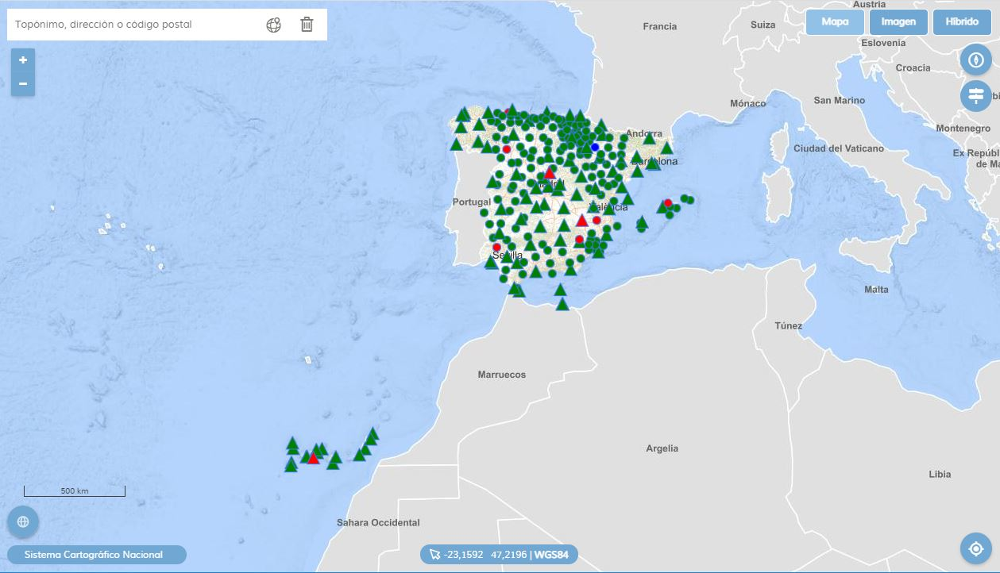

  

<h1 align="center"><strong>VIZREDGAE</strong> <small>Visualizador red GNSS</small></h1>

    
  
   
        
   
   

# Visualizador red GNSS

Las Comunidades Autónomas y el [Instituto Geográfico Nacional](https://www.ign.es) proporcionan conjuntamente un [servicio de posicionamiento diferencial GNSS](http://www.ign.es/web/resources/docs/IGNCnig/SPTR_IGN.pdf) en tiempo real para toda España. Para generar este servicio se utilizan las estaciones permanentes de las redes GNSS de las Comunidades Autónomas con las que existe un acuerdo de colaboración y de la [Red Geodésica Nacional de Referencia de Estaciones Permanentes GNSS (ERGNSS)](https://www.ign.es/web/ign/portal/gds-gnss-estaciones-permanentes). Algunas de las estaciones de la ERGNSS son compartidas entre el IGN y otras instituciones como Puertos del Estado y Comunidades Autónomas. La utilización de un mayor número de estaciones distribuidas por el territorio aumenta la fiabilidad del sistema al incrementarse la integridad del mismo.

 

## 🔹 Funciones del visualizador

* Cambios de mapa base: Mapa, Imagen, Híbrido.
* Buscador de topónimos **IGN Search**.
* Información de coordenadas.
* Localizador.
* Herramienta para mostrar al norte la cartografía.
* Botón mostrar/ocultar leyenda.

Al hacer clic sobre el punto que representa a la estación permanente, aparecerá una ventana emergente en la cual podremos ver la información del elemento

* Código de identificación.
* Estado de emisión.
* Información de satélites.
* Coordenadas.
* Propietario.
* Actividad.

En función del estado emisión, se asignan colores a los símbolos:

* Verde – emitiendo
* Azul – conexión lenta
* Naranja – retardo muy alto
* Rojo – Sin conexión

## 🔹 Actualización de capas

Fijado un tiempo en milisegundos, la aplicación consulta un fichero en formato **geoJSON** con la información actualizada de las estaciones. Accede al fichero, lee su contenido, y sustituye los elementos de la capa por los recién leídos. El refresco no afecta a la aplicación, sino sólo a la capa de estaciones GNSS.

## 🛠 Configuraciones

El fichero [config.js](src/js/config.js) contiene agrupados todos los parámetros configurables. 

* Estados de conexión.
* Colores de representación de los estados. [👉 Lista completa de colores](https://www.w3schools.com/colors/colors_names.asp)
* Simbología aplicada en función del propietario. [👉 Lista completa de simbología](https://componentes.ign.es/api-core/wiki/#M.style.Point)
* Tiempo de **refresco** de la capa de estaciones GNSS.
* Fichero geojson con los datos de representación.
 
## 🚀 Despliegue

* En web pública [https://projects.develmap.com/redgnss/](https://projects.develmap.com/redgnss/)
* En desarrollo en intranet [http://10.67.33.171/web/mashups/redgnss/](http://10.67.33.171/web/mashups/redgnss/)

## ⛲️ Referencias

* [Apuntes de desarrollo](develnotes.md)
* API Documentation [https://componentes.ign.es/api-core/doc/](https://componentes.ign.es/api-core/doc/)
* [APICNIG Plugins](https://componentes.ign.es/api-core/test.html)
* [Wiki APICNIG](https://github.com/IGN-CNIG/API-CNIG/wiki)
* [Mapea Plugins](https://github.com/sigcorporativo-ja/mapea-plugins)
* Visualizador GNSS [http://ntrip.rep-gnss.es](http://ntrip.rep-gnss.es/)
