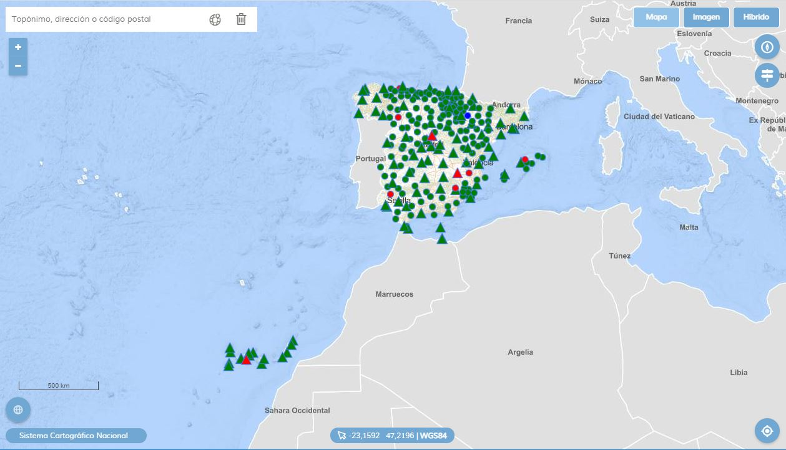

# Visualizador red GNSS

Las Comunidades Autónomas y el Instituto Geográfico Nacional proporcionan conjuntamente un servicio de posicionamiento diferencial GNSS en tiempo real para toda España. Para generar este servicio se utilizan las estaciones permanentes de las redes GNSS de las Comunidades Autónomas con las que existe un acuerdo de colaboración y de la Red Geodésica Nacional de Referencia de Estaciones Permanentes GNSS (ERGNSS). Algunas de las estaciones de la ERGNSS son compartidas entre el IGN y otras instituciones como Puertos del Estado y Comunidades Autónomas. La utilización de un mayor número de estaciones distribuidas por el territorio aumenta la fiabilidad del sistema al incrementarse la integridad del mismo.

 

## Funciones del visualizador

* Cambios de mapa base: Mapa, Imagen, Híbrido.
* Buscador de topónimos IGN Search.
* Información de coordenadas.
* Localizador.
* Herramienta pa mostrar al norte la cartografía.
* Botón mostrar/ocultar leyenda.

Al hacer clic sobre el punto que representa a la estación permanente, aparecerá una ventana emergente en la cual podremos ver la información del elemento

* Código de identificación.
* Estado de emisión.
* Información de satélites.
* Coordenadas
* Propietario.
* Actividad.

## Actualización de capas

Fijado un tiempo en milisegundos, la aplicación consulta un fichero en formato geoJSON con la información actualizada de las estaciones. Accede al fichero, lee su contenido, y sustituye los elementos de la capa por los recién leídos. El refresco no afecta a la aplcación, sino sólo a la capa de estaciones GNSS.

